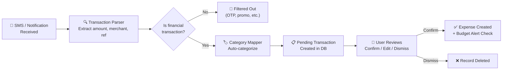
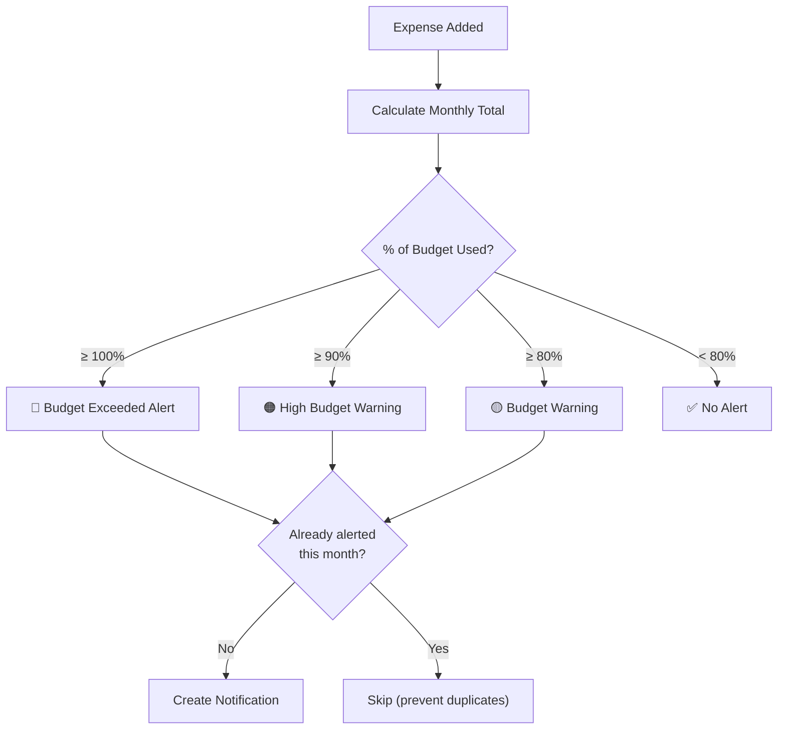

# 🧾 Smart Expense Tracker (AI-Based) — Complete Project Overview

## Project Summary

A **full-stack AI-powered expense tracking mobile application** built with **React Native (Expo)** on the frontend and **Node.js / Express 5** on the backend, using **MongoDB** as the database. The app intelligently detects financial transactions from SMS messages and payment app notifications, auto-categorizes them using a rule-based AI engine, and presents them for user confirmation — all while providing rich analytics, budget management, and security features.

---

## 🏗️ Architecture

```mermaid
graph TB
    subgraph Frontend["📱 Frontend — React Native (Expo)"]
        App["App.js (Provider Tree)"]
        Nav["Navigation Layer"]
        Screens["13 Screens"]
        Components["6 Reusable Components"]
        Context["5 Context Providers"]
        Services["4 Frontend Services"]
        Utils["Utility Modules"]
    end

    subgraph Backend["⚙️ Backend — Node.js / Express 5"]
        Server["server.js (Entry)"]
        Routes["8 Route Modules"]
        Controllers["8 Controllers"]
        Models["5 Mongoose Models"]
        Middleware["Auth Middleware (JWT)"]
        AIServices["2 AI Services"]
    end

    subgraph DB["🗄️ Database"]
        MongoDB["MongoDB (Mongoose 9.x)"]
    end

    Frontend -->|REST API (Axios)| Backend
    Backend --> DB
```

---

## 📂 Complete File Structure

### Backend (`/backend`)

| Layer | File | Purpose |
|-------|------|---------|
| **Entry** | [server.js](file:///c:/smart%20expense%20tracker/backend/src/server.js) | Express 5 server, middleware, route mounting, global error handler |
| **Config** | [db.js](file:///c:/smart%20expense%20tracker/backend/src/config/db.js) | MongoDB connection via Mongoose |
| **Middleware** | [authMiddleware.js](file:///c:/smart%20expense%20tracker/backend/src/middleware/authMiddleware.js) | JWT token verification with tokenVersion validation |
| **Models** | [User.js](file:///c:/smart%20expense%20tracker/backend/src/models/User.js) | User schema with preferences, 2FA fields, password hashing |
| | [Expense.js](file:///c:/smart%20expense%20tracker/backend/src/models/Expense.js) | Expense schema with multi-source tracking (Manual/SMS/Notification) |
| | [PendingTransaction.js](file:///c:/smart%20expense%20tracker/backend/src/models/PendingTransaction.js) | AI-detected pending transactions awaiting user confirmation |
| | [Transaction.js](file:///c:/smart%20expense%20tracker/backend/src/models/Transaction.js) | Standalone transaction model |
| | [Notification.js](file:///c:/smart%20expense%20tracker/backend/src/models/Notification.js) | In-app notification model (budget alerts, system, insights) |
| **Controllers** | [authController.js](file:///c:/smart%20expense%20tracker/backend/src/controllers/authController.js) | Register & Login with JWT generation |
| | [expenseController.js](file:///c:/smart%20expense%20tracker/backend/src/controllers/expenseController.js) | CRUD operations + automatic budget alert notifications |
| | [pendingController.js](file:///c:/smart%20expense%20tracker/backend/src/controllers/pendingController.js) | Pending transaction lifecycle (create, confirm, dismiss, mock) |
| | [dashboardController.js](file:///c:/smart%20expense%20tracker/backend/src/controllers/dashboardController.js) | Dashboard summary aggregation (monthly/weekly stats, budget) |
| | [analyticsController.js](file:///c:/smart%20expense%20tracker/backend/src/controllers/analyticsController.js) | Category breakdown & monthly trends |
| | [userController.js](file:///c:/smart%20expense%20tracker/backend/src/controllers/userController.js) | Profile management, password change, profile image upload, logout-all |
| | [notificationController.js](file:///c:/smart%20expense%20tracker/backend/src/controllers/notificationController.js) | Notification CRUD, mark read, bulk operations |
| | [securityController.js](file:///c:/smart%20expense%20tracker/backend/src/controllers/securityController.js) | 2FA enable/verify/disable with OTP simulation |
| **AI Services** | [transactionParser.js](file:///c:/smart%20expense%20tracker/backend/src/services/transactionParser.js) | NLP-style regex engine to parse Indian banking SMS |
| | [categoryMapper.js](file:///c:/smart%20expense%20tracker/backend/src/services/categoryMapper.js) | Merchant-to-category prediction engine |
| **Routes** | 8 route files | RESTful route definitions for all API endpoints |

### Frontend (`/frontend`)

| Layer | File | Purpose |
|-------|------|---------|
| **Entry** | [App.js](file:///c:/smart%20expense%20tracker/frontend/App.js) | Root component with 5 nested context providers |
| **Navigation** | [AppNavigator.js](file:///c:/smart%20expense%20tracker/frontend/src/navigation/AppNavigator.js) | Auth/Main navigator switch with theme-aware navigation |
| | [AuthNavigator.js](file:///c:/smart%20expense%20tracker/frontend/src/navigation/AuthNavigator.js) | Login ↔ Signup stack |
| | [MainNavigator.js](file:///c:/smart%20expense%20tracker/frontend/src/navigation/MainNavigator.js) | Bottom tab navigator (5 tabs + floating FAB) + nested stack screens |
| **Screens (13)** | [DashboardScreen.js](file:///c:/smart%20expense%20tracker/frontend/src/screens/DashboardScreen.js) | Home dashboard with summary cards, recent transactions, budget meter |
| | [AddExpenseScreen.js](file:///c:/smart%20expense%20tracker/frontend/src/screens/AddExpenseScreen.js) | Manual expense entry with category picker |
| | [EditExpenseScreen.js](file:///c:/smart%20expense%20tracker/frontend/src/screens/EditExpenseScreen.js) | Edit existing expense |
| | [HistoryScreen.js](file:///c:/smart%20expense%20tracker/frontend/src/screens/HistoryScreen.js) | Full transaction history with search, filter, sort |
| | [AnalyticsScreen.js](file:///c:/smart%20expense%20tracker/frontend/src/screens/AnalyticsScreen.js) | Spending analytics with charts and category breakdown |
| | [ProfileScreen.js](file:///c:/smart%20expense%20tracker/frontend/src/screens/ProfileScreen.js) | User profile management with photo upload |
| | [PendingConfirmationsScreen.js](file:///c:/smart%20expense%20tracker/frontend/src/screens/PendingConfirmationsScreen.js) | Review and confirm AI-detected transactions |
| | [NotificationsScreen.js](file:///c:/smart%20expense%20tracker/frontend/src/screens/NotificationsScreen.js) | In-app notification center |
| | [SecuritySettingsScreen.js](file:///c:/smart%20expense%20tracker/frontend/src/screens/SecuritySettingsScreen.js) | 2FA setup, biometric lock, password change, logout-all |
| | [AppPreferencesScreen.js](file:///c:/smart%20expense%20tracker/frontend/src/screens/AppPreferencesScreen.js) | Theme, notifications, budget alert preferences |
| | [TransactionPermissionScreen.js](file:///c:/smart%20expense%20tracker/frontend/src/screens/TransactionPermissionScreen.js) | SMS & notification access permission setup |
| | [LoginScreen.js](file:///c:/smart%20expense%20tracker/frontend/src/screens/LoginScreen.js) | User login |
| | [SignupScreen.js](file:///c:/smart%20expense%20tracker/frontend/src/screens/SignupScreen.js) | User registration |
| **Components** | [TransactionConfirmationCard.js](file:///c:/smart%20expense%20tracker/frontend/src/components/TransactionConfirmationCard.js) | Swipeable card for confirming/dismissing detected transactions |
| | [TransactionItem.js](file:///c:/smart%20expense%20tracker/frontend/src/components/TransactionItem.js) | Reusable transaction list item |
| | [CustomButton.js](file:///c:/smart%20expense%20tracker/frontend/src/components/CustomButton.js) | Styled button component |
| | [CustomInput.js](file:///c:/smart%20expense%20tracker/frontend/src/components/CustomInput.js) | Styled input component |
| | [ThreeDComponent.js](file:///c:/smart%20expense%20tracker/frontend/src/components/ThreeDComponent.js) | 3D visual component (native) |
| | [ThreeDComponent.web.js](file:///c:/smart%20expense%20tracker/frontend/src/components/ThreeDComponent.web.js) | 3D visual component (web) |
| **Context** | [AuthContext.js](file:///c:/smart%20expense%20tracker/frontend/src/context/AuthContext.js) | Authentication state, token storage, login/logout |
| | [ThemeContext.js](file:///c:/smart%20expense%20tracker/frontend/src/context/ThemeContext.js) | Dark/Light theme toggle with server sync |
| | [PreferencesContext.js](file:///c:/smart%20expense%20tracker/frontend/src/context/PreferencesContext.js) | User preferences management |
| | [NotificationsContext.js](file:///c:/smart%20expense%20tracker/frontend/src/context/NotificationsContext.js) | In-app notification state and badge count |
| | [TransactionDetectionContext.js](file:///c:/smart%20expense%20tracker/frontend/src/context/TransactionDetectionContext.js) | SMS/notification detection state management |
| **Services** | [api.js](file:///c:/smart%20expense%20tracker/frontend/src/services/api.js) | Axios instance with token interceptor |
| | [transactionDetectionService.js](file:///c:/smart%20expense%20tracker/frontend/src/services/transactionDetectionService.js) | SMS/notification detection simulation engine |
| | [transactionParserService.js](file:///c:/smart%20expense%20tracker/frontend/src/services/transactionParserService.js) | Client-side transaction text parser |
| | [categoryMapperService.js](file:///c:/smart%20expense%20tracker/frontend/src/services/categoryMapperService.js) | Client-side merchant-to-category mapper |
| **Theme** | [colors.js](file:///c:/smart%20expense%20tracker/frontend/src/theme/colors.js) | Light & dark color palettes + spacing & border-radius tokens |
| **Utils** | [currencyUtils.js](file:///c:/smart%20expense%20tracker/frontend/src/utils/currencyUtils.js) | Multi-currency formatting (INR, USD, EUR, GBP, JPY) |

---

## 🧠 AI / Intelligent Features

### 1. Transaction Parser ([transactionParser.js](file:///c:/smart%20expense%20tracker/backend/src/services/transactionParser.js))

A regex-based NLP engine that parses raw Indian banking SMS and payment app notifications:

- **Blacklist filtering** — Ignores OTPs, promotions, balance inquiries
- **Amount extraction** — Handles `Rs.`, `INR`, `₹` formats with commas and decimals
- **Transaction type detection** — Classifies as Debit/Credit via keyword matching
- **Merchant extraction** — Parses "paid to X", "sent to X", "at X", VPA, and app-specific formats
- **Reference extraction** — Captures UPI refs, Txn IDs, and 12-digit reference numbers

### 2. Category Mapper ([categoryMapper.js](file:///c:/smart%20expense%20tracker/backend/src/services/categoryMapper.js))

A 3-tier rule-based category prediction engine:

| Tier | Method | Confidence |
|------|--------|------------|
| 1 | **Exact merchant match** (90+ merchants mapped) | 80–95% |
| 2 | **Partial/fuzzy match** | 50–85% |
| 3 | **Keyword-based fallback** | 60–70% |
| 4 | **Default** ("Other") | 50% |

**Categories supported:** Shopping & Retail, Food & Dining, Transport, Entertainment, Bills, Other

### 3. Transaction Detection Service ([transactionDetectionService.js](file:///c:/smart%20expense%20tracker/frontend/src/services/transactionDetectionService.js))

Client-side simulation engine for SMS and notification interception:

- 12 realistic mock SMS templates (Indian bank formats)
- 7 mock notification payloads (Google Pay, PhonePe, Paytm, etc.)
- Event listener pattern for real-time transaction detection
- Custom SMS simulation for testing
- Production-ready architecture (ready to swap with native modules)

---

## 🔐 Security Features

| Feature | Implementation |
|---------|---------------|
| **JWT Authentication** | 30-day tokens with `tokenVersion` for session invalidation |
| **Password Hashing** | bcrypt with salt rounds (10) via Mongoose pre-save hook |
| **Two-Factor Auth (2FA)** | OTP-based enable/verify/disable flow (simulated delivery) |
| **Biometric Authentication** | `expo-local-authentication` integration |
| **Token Versioning** | Increment `tokenVersion` to invalidate all sessions on password change |
| **Logout All Devices** | Server-side token invalidation via version increment |
| **Password Change** | Validates current password, enforces 8-char minimum, auto-invalidates sessions |
| **Profile Image Validation** | Format check (JPG/PNG/WEBP), 5MB size limit |

---

## 📊 API Endpoints (8 Route Groups, 25+ Endpoints)

| Route Group | Endpoints | Description |
|-------------|-----------|-------------|
| `POST /api/auth/register` | Register | Create new user account |
| `POST /api/auth/login` | Login | Authenticate and receive JWT |
| `GET /api/expenses` | List | Expenses with category/date filters |
| `POST /api/expenses` | Create | Add expense + trigger budget alerts |
| `PUT /api/expenses/:id` | Update | Edit expense fields |
| `DELETE /api/expenses/:id` | Delete | Remove expense (ownership check) |
| `GET /api/pending-expenses` | List | Get pending AI-detected transactions |
| `POST /api/pending-expenses` | Create | Submit detected transaction (raw or parsed) |
| `POST /api/pending-expenses/:id/confirm` | Confirm | Approve → creates Expense, deletes pending |
| `POST /api/pending-expenses/:id/dismiss` | Dismiss | Reject → deletes pending record |
| `POST /api/pending-expenses/mock` | Mock | Generate 7 test pending transactions |
| `GET /api/dashboard/summary` | Dashboard | Monthly/weekly stats, budget, top category |
| `GET /api/analytics` | Analytics | Category breakdown + monthly trends |
| `GET /api/user/profile` | Profile | Get user profile |
| `PUT /api/user/profile` | Update | Edit name, email, phone |
| `PUT /api/user/preferences` | Preferences | Update theme, notifications, budget settings |
| `PUT /api/user/change-password` | Password | Change password + session invalidation |
| `PUT /api/user/profile/image` | Upload | Base64 profile image upload |
| `DELETE /api/user/profile/image` | Remove | Delete profile image |
| `POST /api/user/logout-all` | Logout All | Invalidate all active sessions |
| `GET /api/notifications` | List | Get all notifications |
| `GET /api/notifications/unread-count` | Badge | Get unread notification count |
| `POST /api/notifications` | Create | Create notification |
| `PUT /api/notifications/:id/read` | Mark Read | Mark single notification read |
| `PUT /api/notifications/read-all` | Mark All | Mark all as read |
| `DELETE /api/notifications/:id` | Delete | Delete single notification |
| `DELETE /api/notifications/all` | Clear | Delete all notifications |
| `POST /api/security/2fa/enable` | Enable 2FA | Generate and send OTP |
| `POST /api/security/2fa/verify` | Verify 2FA | Verify OTP and activate 2FA |
| `POST /api/security/2fa/disable` | Disable 2FA | Turn off 2FA |

---

## 🎨 UI/UX Features

- **Dark/Light Theme** — Full theme system with server-synced preference, anti-flicker on load
- **Floating Action Button** — Prominent centered "+" button in bottom tab bar
- **Custom Bottom Tab Bar** — Rounded, elevated tab bar with icon + label, highlight effect
- **Notification Badge** — Real-time unread count on notification icon
- **Budget Progress Meter** — Visual budget utilization on dashboard
- **Multi-Currency Support** — INR, USD, EUR, GBP, JPY with locale-aware formatting
- **Profile Photo** — Camera/gallery picker with image manipulation, Base64 storage
- **Transaction Cards** — Swipeable confirmation cards for AI-detected transactions

---

## 🛠️ Tech Stack Summary

| Layer | Technology | Version |
|-------|-----------|---------|
| **Frontend** | React Native (Expo) | SDK 54 |
| **Navigation** | React Navigation 7 | Bottom Tabs + Native Stack |
| **State** | React Context API | 5 Context Providers |
| **HTTP** | Axios | 1.15 |
| **Backend** | Express.js | 5.2 |
| **Database** | MongoDB via Mongoose | 9.4 |
| **Auth** | JWT (jsonwebtoken) | 9.0 |
| **Hashing** | bcrypt | 6.0 |
| **Biometrics** | expo-local-authentication | 17.0 |
| **Image** | expo-image-picker + manipulator | 17.0 / 14.0 |
| **Animations** | react-native-reanimated | 4.1 |

---

## 📈 Key Metrics

| Metric | Count |
|--------|-------|
| **Total Files (source)** | ~50+ |
| **Backend Controllers** | 8 |
| **Backend Models** | 5 |
| **Backend Routes** | 8 |
| **AI Services** | 2 (Parser + Mapper) |
| **Frontend Screens** | 13 |
| **Frontend Components** | 6 |
| **Context Providers** | 5 |
| **Frontend Services** | 4 |
| **API Endpoints** | 29+ |
| **Mapped Merchants** | 90+ (in category mapper) |
| **Supported Currencies** | 5 |

---

## 🔄 Core Workflows

### Transaction Detection → Confirmation Pipeline



### Budget Alert System



---

> **Status:** The project is a fully functional, production-ready architecture with a complete frontend-backend integration. The AI services currently use rule-based parsing (regex + merchant mapping) with a simulation layer for SMS/notification detection that can be swapped for native Android modules in production deployment.
